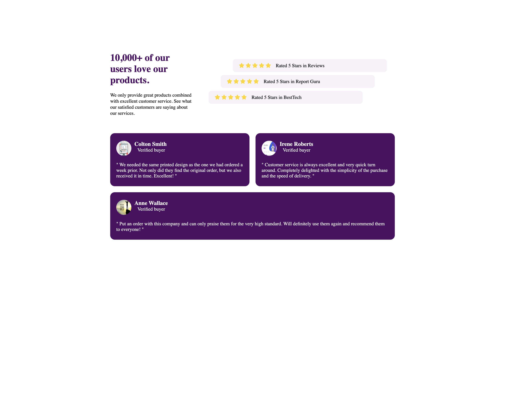

## Social proof 
#### Comme l'indique l'image du projet, la structure et le style sont trés enchissant et nous permettent d'explorer un peu plus en profondeur les différentes notions desbalises HTML et du styles CSS qui sont:
- J'ai appris comment intégré un icon dans ma page, d'abord la connexion avec la page qui contient les icons(FontAwesome,...) et l'intégration de l'icon.
- display: flex; qui rend le contenu flexible 
- float:left; qui rend l'élément flotant c'est à dire que les élement qui sont en dessous de lui peuvent se mettre sur la même ligne avec l'élement même si le conteneur est de type block.
-  flex-direction: column; 
- !important;

